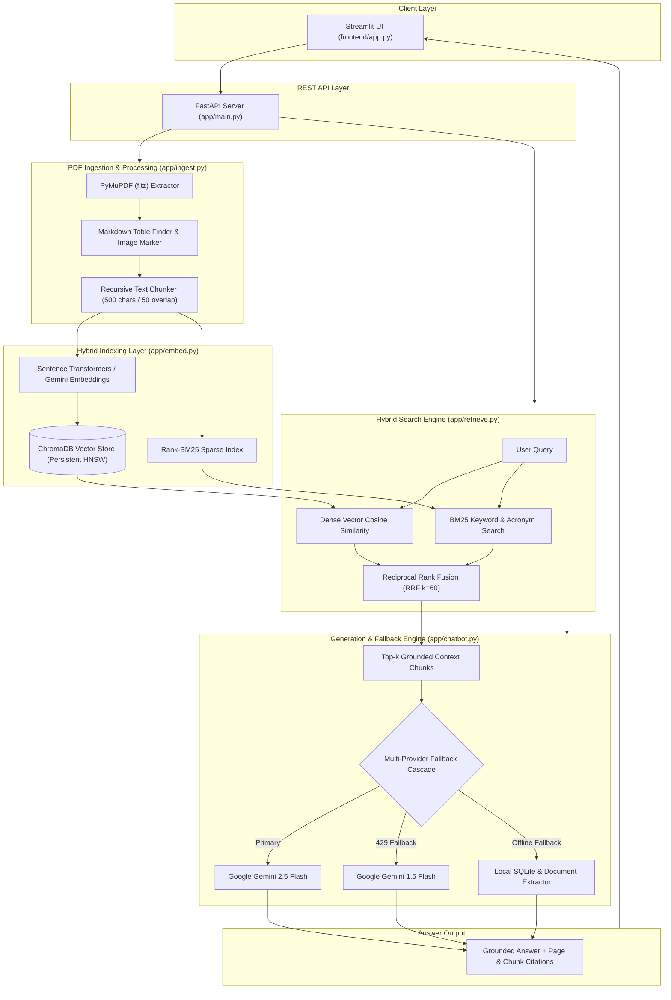

# 🚀 DocuMind-AI

An AI-powered Retrieval-Augmented Generation (RAG) platform enabling semantic search, multi-provider LLM answer synthesis, inline citations, and multi-document comparative analysis over PDF corpora.

[](https://www.python.org/)
[](https://fastapi.tiangolo.com/)
[](https://streamlit.io/)
[](https://pymupdf.readthedocs.io/)
[](https://ai.google.dev/)
[](https://www.trychroma.com/)
[](https://docs.pytest.org/)
[](https://saptaparnisaha23-byte-documind-ai-frontendapp-dnqug9.streamlit.app/)

---

## 🎥 Demo & Deployed Links

- 🌐 **Live Deployed App (Streamlit Web UI)**: [https://saptaparnisaha23-byte-documind-ai-frontendapp-dnqug9.streamlit.app/](https://saptaparnisaha23-byte-documind-ai-frontendapp-dnqug9.streamlit.app/)
- ⚡ **Live Local REST API**: `http://localhost:8000` (FastAPI Backend Server & Swagger Docs)
- 💻 **Live Local Streamlit UI**: `http://localhost:8501` (Streamlit App)
- 📂 **GitHub Repository**: [https://github.com/saptaparnisaha23-byte/DocuMind-AI](https://github.com/saptaparnisaha23-byte/DocuMind-AI)

---

## 🏷️ Official Releases & Project Deliverables

| Release Tag | Stage Title | Description & Artifact Links |
|---|---|---|
| **[`v1.0-m1`](https://github.com/saptaparnisaha23-byte/DocuMind-AI/releases/tag/v1.0-m1)** | Milestone 1 (Alpha Build) | Core working RAG engine, PyMuPDF parsing, ChromaDB HNSW store, FastAPI backend, initial Streamlit UI, 3 ADRs. |
| **[`v1.0-final`](https://github.com/saptaparnisaha23-byte/DocuMind-AI/releases/tag/v1.0-final)** | Milestone 2 (Final Build) | Multi-Document Comparison engine, adaptive prompt response levels, 20 Q&A eval report, reflection piece, 3rd year roadmap. |
| **[`v1.0-showcase`](https://github.com/saptaparnisaha23-byte/DocuMind-AI/releases/tag/v1.0-showcase)** | Part 3 (Final Showcase & Submission) | Production Streamlit Cloud deployment, zero white-page rerun optimizations, resume PDF, showcase slide PNG/PDF, and test suite. |

### 📄 Milestone & Release PDF/PNG Assets
- 📊 **Showcase Slide (PNG)**: [`docs/showcase_slide.png`](docs/showcase_slide.png)
- 📄 **Showcase Slide (PDF)**: [`docs/showcase_slide.pdf`](docs/showcase_slide.pdf)
- 📝 **Resume Bullets (PDF)**: [`docs/resume_final.pdf`](docs/resume_final.pdf)
- 📈 **20 Q&A Benchmark Report**: [`docs/eval_report.md`](docs/eval_report.md)

---

## 📌 Problem Statement

Reading and locating specific information inside long PDF documents (e.g., technical specifications, legal contracts, research papers) is time-consuming and inefficient. Traditional keyword searches fail when user queries use different phrasing or conceptual terminology than the source document.

**DocuMind-AI** solves this by implementing an end-to-end Retrieval-Augmented Generation (RAG) pipeline. It extracts text and structural elements from PDF files using PyMuPDF, splits the text into 500-character semantic chunks with 50-character overlap, generates dense vector embeddings using Sentence Transformers (`all-MiniLM-L6-v2`) and Google Gemini Embeddings (`gemini-embedding-001`) to support memory-safe cloud deployment, indexes them in ChromaDB alongside an in-memory BM25 sparse index, and combines search results via Reciprocal Rank Fusion ($RRF\ k=60$). Retrieved chunks are passed as context to Google Gemini to synthesize grounded answers backed by chunk-level source citations and PDF page previews.

---

## 🏗️ Architecture Diagram

The system uses a 5-tier architecture connecting the Streamlit frontend, FastAPI REST gateway, chunking & ingestion pipeline, hybrid HNSW vector + BM25 keyword index, and resilient multi-model Gemini LLM fallback cascade.



---

## 🛠 Tech Stack

| Component Layer | Tool / Technology | Version / Specification | Rationale & Usage |
|---|---|---|---|
| **Core Runtime** | Python | 3.10+ / 3.12 | Primary language for NLP pipeline, vector calculations, and web servers |
| **PDF Extraction** | PyMuPDF (`fitz`) | 1.23+ | Ultra-fast C-extension PDF text extraction, markdown table detection, page tracking |
| **Text Segmentation** | Custom Recursive Chunker | 500 chars / 50 overlap | Retains cohesive paragraph context while preventing semantic dilution |
| **Dense Embeddings** | Sentence Transformers / Gemini | `all-MiniLM-L6-v2` / `gemini-embedding-001` | 384d / 768d dense vectors for high-precision semantic similarity search |
| **Vector DB** | ChromaDB | 0.4+ | Persistent HNSW vector database with metadata filtering by document and page |
| **Sparse Index** | Rank-BM25 | 0.2.2 | BM25 algorithm for exact keyword and acronym matching |
| **Rank Fusion** | Reciprocal Rank Fusion | RRF ($k=60$) | Combines dense vector similarity scores and BM25 sparse keyword rankings |
| **Primary LLM** | Google Gemini API | `gemini-2.5-flash` / `gemini-1.5-flash` | Context-grounded factual answer generation with low latency |
| **Fallback LLM Tier** | Gemini Cascade | `gemini-2.0-flash` → `gemini-1.5-flash` | Cascades automatically on HTTP 429 quota limits or rate limit spikes |
| **Backend API** | FastAPI + Uvicorn | 0.109+ | Async REST API service (`/upload`, `/query`, `/chats`, `/documents`) |
| **Web Interface** | Streamlit | 1.30+ | Reactive frontend with glassmorphism UI, light/dark theme switch, chat history |
| **Database** | SQLite3 | Native | Persistent storage for user sessions, chat histories, and rename metadata |
| **Testing** | Pytest | 8.0+ | Automated test suite across RAG pipeline modules |

---

## ⚙️ Quickstart

### Prerequisites

- **Python 3.10+** (Python 3.12 recommended)
- **Google Gemini API Key** ([Get an API Key](https://aistudio.google.com/))

### Step 1: Clone the Repository

```bash
git clone https://github.com/saptaparnisaha23-byte/DocuMind-AI.git
cd DocuMind-AI
```

### Step 2: Set Up Virtual Environment & Dependencies

```bash
# Create virtual environment
python -m venv venv

# Activate virtual environment
# Windows (PowerShell):
.\venv\Scripts\Activate.ps1
# Linux / macOS:
source venv/bin/activate

# Install dependencies
pip install -r requirements.txt
```

### Step 3: Configure Environment Variables

Create a `.env` file in the root directory:

```env
GEMINI_API_KEY=your_gemini_api_key_here
GEMINI_MODEL=gemini-2.5-flash
PORT=8000
```

### Step 4: Run the Application

#### Option A: Launch Streamlit Web UI (Direct Web Application)

```bash
streamlit run frontend/app.py
```
Open your browser at `http://localhost:8501`

#### Option B: Launch FastAPI REST Server & Streamlit App

```bash
# Terminal 1: Run FastAPI backend
uvicorn app.main:app --reload --port 8000

# Terminal 2: Run Streamlit frontend
streamlit run frontend/app.py
```
Access the REST API Swagger Docs at `http://localhost:8000/docs` and Streamlit UI at `http://localhost:8501`.

### Step 5: Run Automated Tests

```bash
pytest
```

---

## 📊 Data Sources

DocuMind-AI operates over PDF document corpora uploaded dynamically by users or stored in `data/pdfs/` and `uploads/`.

- **Supported Input Format**: `.pdf` (text-based PDFs, research papers, legal documents, formatted tables).
- **Indexed Metadata**: `document_name`, `page` (1-indexed page number), `chunk_id`, `upload_time`.

---

## 📑 ADRs (Architecture Decision Records)

All core architecture decisions are documented in `docs/adr/`:

- **ADR-001**: Selection of ChromaDB as Vector Database
- **ADR-002**: Google Gemini as Primary LLM Provider
- **ADR-003**: Source Citation Engine for Answer Transparency
- **ADR-004**: Reciprocal Rank Fusion (RRF) & Hybrid Search Engine

---

## ✨ Mini-Extension

DocuMind-AI includes two major mini-extensions that go beyond standard single-file RAG tutorials:

1. **Multi-Document Comparative Analysis Engine**:
   - Enables querying across single documents or an entire document collection.
   - Provides structured document summaries, key takeaway bullet points, and multi-document comparison summaries.

2. **Resilient LLM Fallback Cascade & Standalone Mode**:
   - Automatically detects HTTP 429 quota limits or offline backend status and cascades across model tiers or operates seamlessly in standalone mode using local SQLite and ChromaDB.

---

## ⚠️ Known Limitations

- **Scanned Image-Only PDFs**: Pure scanned image PDFs without an embedded OCR text layer require pre-OCR processing (planned for future release).
- **Large File Processing Latency**: Parsing and generating dense embeddings for 200+ page PDFs takes 15–30 seconds on local CPU hardware.

---

## 🗺️ What I'd Do in 3rd Year

See the complete 12-month roadmap in `docs/design_doc.md`:

- Hybrid search optimization with Qdrant and pgvector.
- Multi-format document ingestion (DOCX, PPTX, HTML, Markdown).
- Agentic RAG workflows (query decomposition and self-verification using LangGraph).
- Containerized cloud deployment with Docker Compose, GitHub Actions CI/CD, and Prometheus metrics.

---

## 📄 License + Acknowledgements

- **License**: MIT License
- **Developer**: Saptaparni Saha (B.Tech CSE - AI & Data Engineering, Lovely Professional University)
- **Segment**: Foundations of Applied Machine Learning (Summer Internship 2026)
- **Problem Statement Code**: I2 – Document Q&A (RAG over a Focused Corpus)
